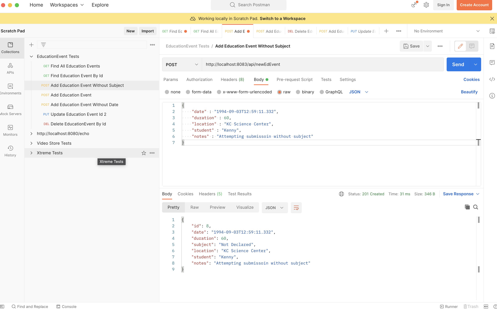
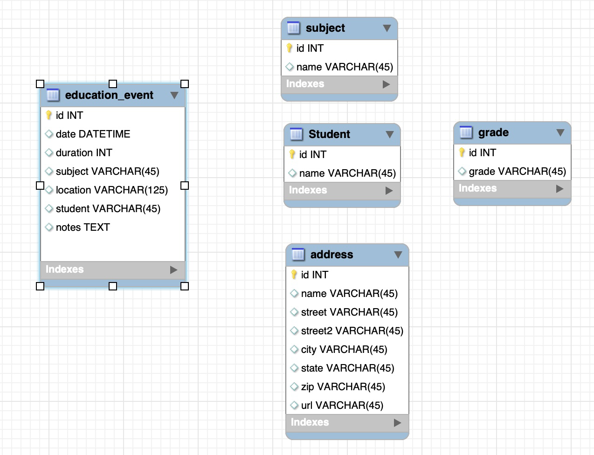
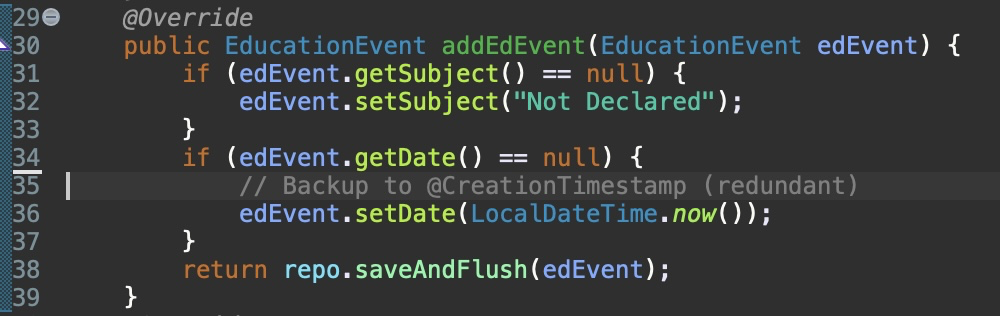
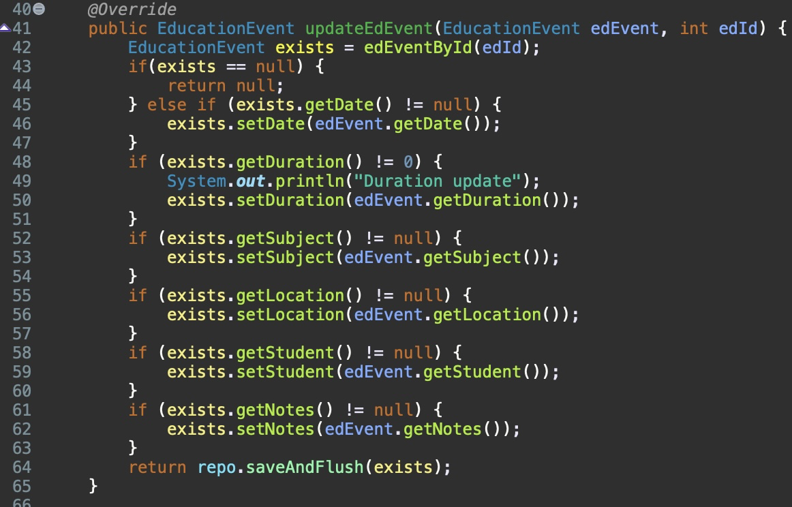
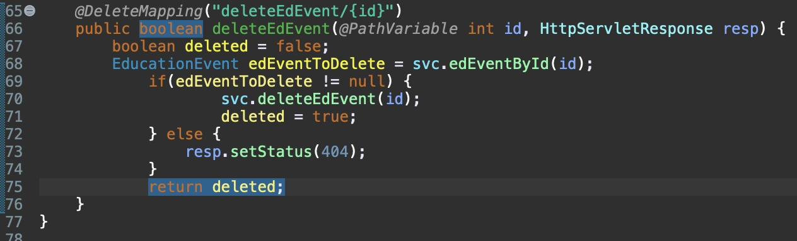

# Homeschool Hours Tracker

## Author

 Ken Pederson (Developer, Repo Owner, Database Administrator) 

## Overview

For my SkillDistillery event-tracker project, I have built the backend of an application named Homeschool Hours Tracker. Full credit for the idea of this application goes to my wonderful wife who has homeschooled our boys from the very beginning after her 7-year career as a high school science teacher. The intent of this application is to solve the problem of Missouri's requirement for fellow parents who homeschool their children, to log...
* Hours invested across core and elective subjects
* The location of where the education was conducted

In the state of Missouri, once a child is the age of 7 as of 1 July, the tracking of hours is required. Parents must log...
* A minimum of 400 hours teaching the core subjects at the "regular homeschool location" (math, science, social studies, language arts, and reading)
* A minimum of 600 hours total must be recorded teaching the core subjects (non-core subjects are categorized as electives)
* A minimum of 1,000 hours must be recorded in total
per year (homeschool years begin 1 July and run through 30 June)

This application will provide our family and fellow Missouri parents with a solution to satisfying the state hour logging requirements. Any audit homeschooling parents may undergo will be easily managed through this one-stop solution. 

## Take The Homeschool Hours Tracker For A Test Drive!

If you would like to visit the Education Event tracker site, please feel free to use the link below! Reference the table within the "Testing With Postman" section below for example URI's you can use to interact with the application. If you have any questions or would like to discuss this project, please don't hesitate to email me at ken@kendev131.com. 

<a href="">PLACEHOLDER Click Here to Visit Homeschool Hours Tracker Project Site</a></>

## Description

The first iteration of this application is an extremely simplified approach of using only one table in the database. Multiple other tables, though not initially implemented, were created to enable greater functionality at a later time.

In this first version, the backend has been created using REST and thoroughly tested using Postman to ensure URL's invoke the desired results.

## Methodology

One pillar at a time.

What I enjoyed most about this stage of building the application is the very straight forward approach of building the backend from "the ground up". Each functionality piece began with the Repository (where applicable), then Service layer, the Service Implementation layer, next the Controller and finally using Postman to ensure functionality. Nothing else occurred until each step of this process proved successful. This approach kepy each stage of functionality development clear and distinct from the others, thereby preventing getting "lost in the sauce".

## Testing With Postman

To test the backend of the application visit the <a href="https://www.postman.com/">Postman</a> site. Once there, reference the table below for URL's testing the validity of the code once you've started up the program in the SpringToolSuite4 Boot Dashboard.

| HTTP Verb | URI                    | Request Body | Response Body             | Functionality                                                              |
|:---------:|:-----------------------|:------------:|:--------------------------|:---------------------------------------------------------------------------|
| GET       | '/api/edEvents'        |              |  List of education events | Return a list of all education events                                      |
| GET       | '/api/edEvents/4'      |              |  Single education event   | Return an EducationEvent by Id                                             |
| POST      | '/api/newEdEvent'      | JSON         |  Created education event  | Adds a new EducationEvent (see example code for a new event below)         |
| PUT       | '/api/updateEdEvent/2' | JSON         |  Updated education event  | Modifies an existing EducationEvent (6 events exist in the database)       |
| DEL       | '/api/deleteEdEvent/7' |              |                           | Deletes an EducationEvent. Assumes you have created 1 new EducationEvent   |

* Example code to use for POST routes below. Note that the date and subject may be omitted due to default values being set in the service file.

{
    "date" : "2022-09-04T12:59:11.332",
    "duration" : 15,
    "subject" : "Language Arts",
    "location" : "Home",
    "student" : "Sally",
    "notes" : "Test adding event, all fields included."
}

* Example code to use for PUT route can utilize any variation of the code above. The example route in the table is set to 2 but may be changed to 3 through 6 or any events added with the POST route. Please do not modify EducationEvent 1 due to all JUnit tests being written for its original data.

## Lessons Learned

This project proved vital in gaining experience of the following...
* How the Controllers mapping annotation directly links with what appears in the URL
* The strict syntax requirements of the methods listed in the Repository for successful SQL queries (specific references to fields of an entity and exact wording for "finding" what you're looking for)
* The inability to write in certain methods in the Repository (such as findAll, findById, adding new instances of an event, etc.). These examples all cause the application to break, leading to a quick realization of the appropriate types of methods that belong in the Repository.
* The requirement for Controllers to use wrapper classes in order to function
* The use of the @CreationTimestamp greatly simplifies the use of LocalDateTime fields
* The use of Postman for testing code and correlating the direct relationship of the URL to the methods as well as further verification of changes through writing SQL queries to the database in the zsh Terminal.

## Technologies 

* AWS- EC2
* Bootstrap
* Git
* GitHub
* Gradle
* Java 
* MySQL Workbench
* Postman
* SpringToolSuite4
* Spring Data JPA
* Spring Boot
* Spring MVC
* Terminal -zsh

## Stretch/Future Goals

After a minimum viable product is produced, the intent for this application is to incorporate the remaining tables of the database as seen above. At this time, only the "education_event" table is utilized. It is my intent to also use this first concept, once fully functional, to inspire new ideas beyond what I've already imagined. Current stretch goals include...
* Google Maps through the address table for parents to be able to remember a site should they choose to later revisit and share the location with fellow homeschool families.
* Create a login functionality 
* Allow users to download an Excel or Numbers version of their data as a backup or for audit purposes
* Create charts and graphs that show progress over time through each grade year
* Allow for tracking of resources used to teach different subjects across each grade
* USe the application as a centerpiece for a homeschool forum

After careful consideration of all the desired functionality with my wife has been made, work will begin on a separate branch while retaining the original work. 

## A Few Screen Shots Taken During The Backend Creation Journey

* Code excerpt for adding a new Education Event in the database. Extra code was written to ensure default values for the subject being recorded and the date when the event occurred. By setting the subject to "Not Declared" the intent is to raise awareness to the user so they will update then event with the correct subject. The date is set to "now" as this will most likely be the case if the user is recording updates in real time. Regardless, it serves as a starting point.

 

 
* Code excerpt of how an event is updated. Every field is verified through if/else logic.

 

 
* Code excerpt of how an event is deleted and ensuring a 404 code is returned when the event being referred to no longer exists.

 

